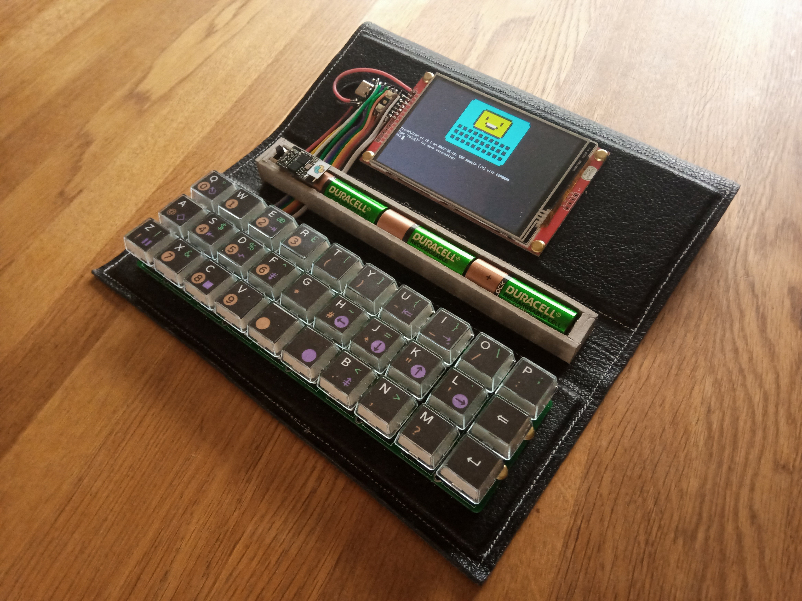
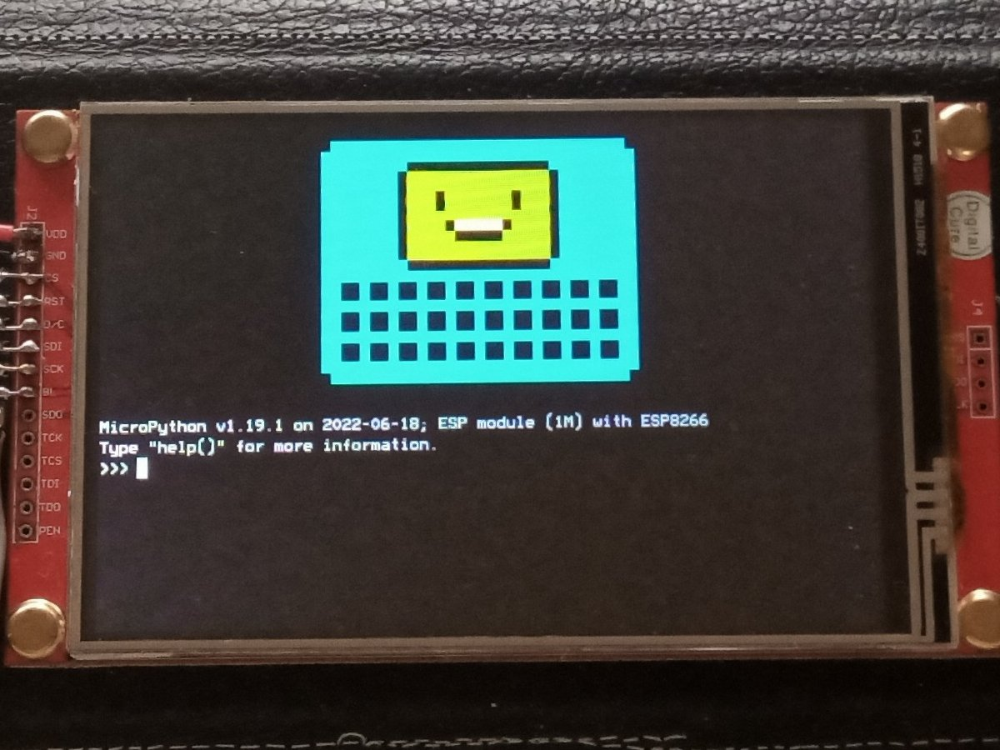
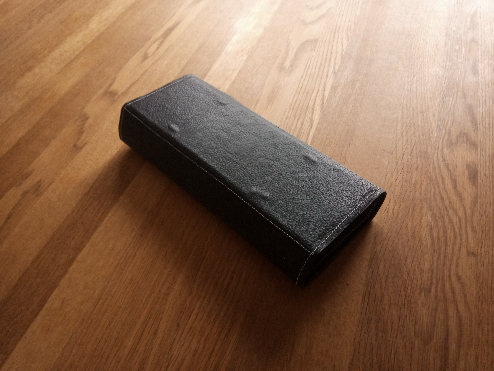

# VT2040
Portable serial terminal, based on an RP2040 dev board, with a [Gherkin keyboard](https://www.40percent.club/2016/11/gherkin.html) and an ILI9488 480x320 LCD screen.

## Hardware

Any RP2040 dev board with at least 19 GPIO pins (11 for the keyboard, 6 for the screen, 2 for serial) should work.

The screen is an ILI9488 480x320 LCD, which must be configured for 4-wire SPI. They usually have 14 pins at one end and 4 pins at the other.

The keyboard is based on the 40percent.club Gherkin - just the main PCB, 30 1N4148 diodes, and 30 MX-compatible keyswitches.

## Software

The VT2040 software is made up of a handful of small, hopefully readable, reusable modules:

* [VT2040-font](/ncrawforth/VT2040-font): an antialiased 6x13-pixel bitmap font.
* [VT2040-term](/ncrawforth/VT2040-term): a small but full-featured terminal emulator.
* [VT2040-lcd](/ncrawforth/VT2040-lcd): a PIO-based driver for the ILI9488 LCD.
* [VT2040-keyb](/ncrawforth/VT2040-keyb): a keyboard driver.
* [VT2040-serial](/ncrawforth/VT2040-serial): a PIO-based serial port, with special considerations for talking to an ESP8266.

## Prototype







The prototype gets about 18 hours out of 3 AA batteries. It has a socket for an ESP-01 - the one in the pictures has MicroPython installed. The keycaps are inexpensive relegendable ones, but they're not very comfortable to type on.

The dev board is a Waveshare RP2040 Zero.

The LCD's CS, RST, DC, MOSI, SCK and BL pins are connected to the GPIO pins configured in ``lcd.h``, and its 5V and GND are connected to the dev board's 5V and GND.

The keyboard's 11 row and column pins are connected to the GPIO pins configured in ``keyb.h``. *TODO: add a photo showing the row and column pins on the keyboard PCB.*

The ESP-01's RX and TX pins are connected directly to the pins configured in ``serial.h`` (both devices use 3.3V), its 3.3V and GND are connected to the dev board's 3.3V and GND, and its CH_PD pin is pulled high.

Finally, the batteries are connected to the dev board's 5V and GND (through a switch). **There's nothing to prevent 5V being applied to the batteries when connected to USB, so turn off the switch to avoid damage.** *TODO: fix that with a trickle charge resistor or something.*

## Building

These instructions are for Alpine Linux. Adjust them for your distro.

### Install the required packages
As root:
```sh
apk add git cmake gcc-arm-none-eabi g++ python3 newlib-arm-none-eabi make
```

### Download the SDK and the VT2040 repositories
```sh
git clone https://github.com/raspberrypi/pico-sdk
git clone https://github.com/ncrawforth/VT2040
cd VT2040
git submodule update --init
```

### Assign the GPIO pins
``lcd.h``, ``keyb.h`` and ``serial.h`` contain pin assignments for the LCD, keyboard and serial port respectively. Change them to match your hardware.

Depending on which way your LCD is mounted, you may need to change the value of ``LCD_ROTATE`` in ``lcd.h``.

### Build
```sh
mkdir build
cd build
cmake ..
make
```

### Install
Press and hold the BOOTSEL button on the RP2040 dev board and plug it into your computer's USB port, then release BOOTSEL. It will appear as a USB drive. Copy vt2040.uf2 from the build directory onto it.
